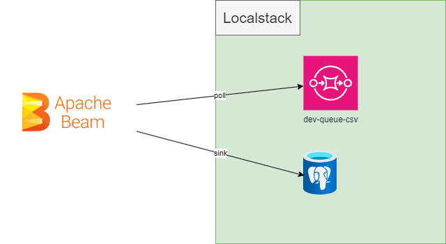
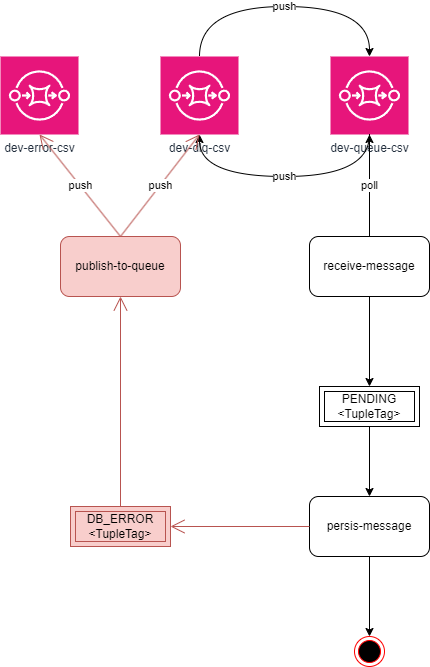
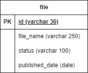

# beam-app
Apache Beam SQS to Postgres ingestion flow example
This project is built on jdk17. There is a localstack emulator which helps this project to provide AWS SQS on local environment.
Application consumes data from csv queue and process it in two beam functions  one is mapping the other is for sink operation.
Processed data will be sinked to postgresdb to FileRepository

## Conceptual Diagram

## State Flow Diagram
Red ones have not been implemented yet but idea is reprocess document if there is an error. If error is not defined then push it to another queue for future
process.

## Entity Relation

